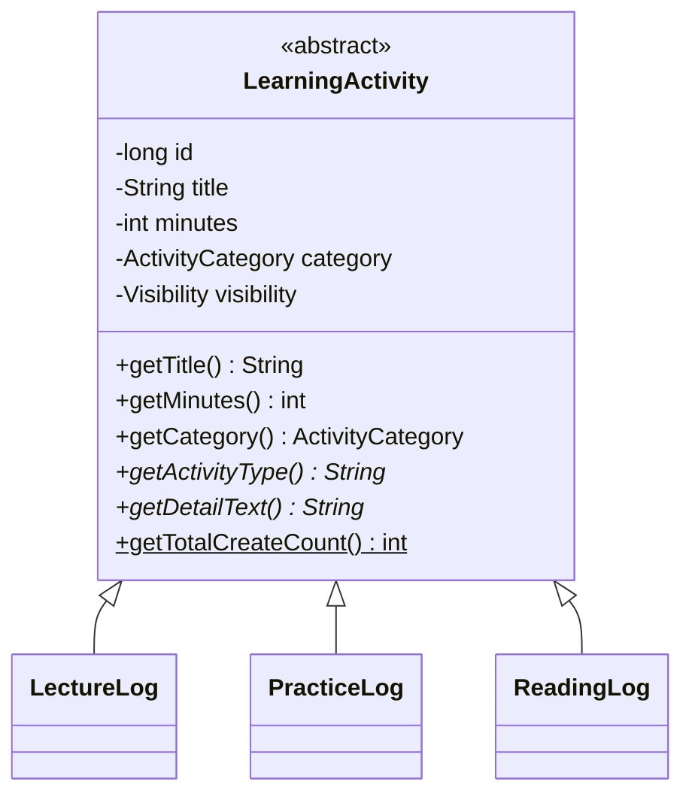
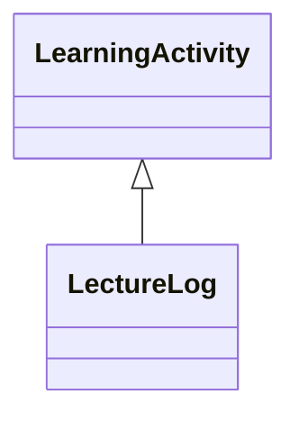
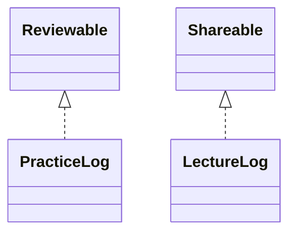
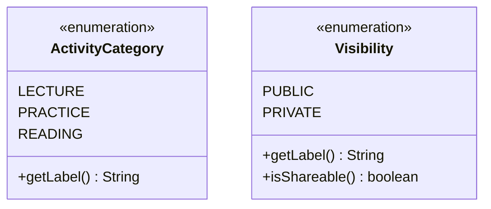
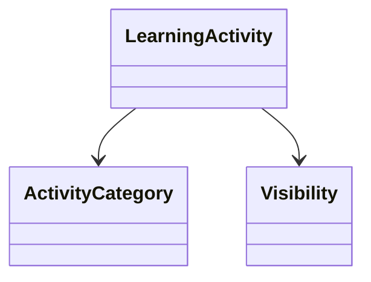
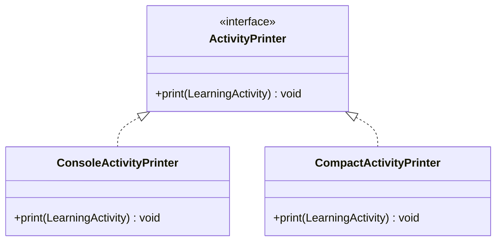
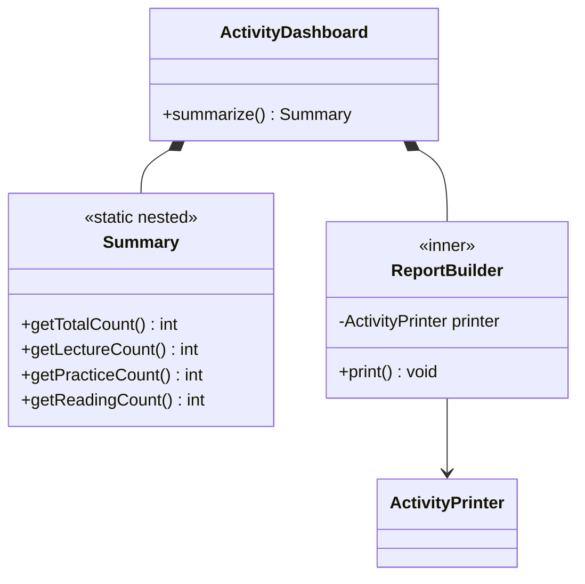
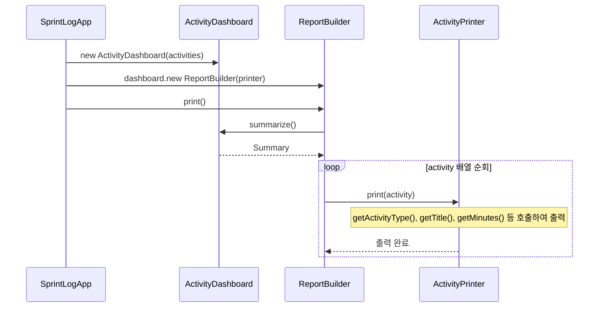

# Java UML classDiagram과 sequenceDiagram 정리

## 학습 날짜

2026-05-12

## 학습 주제

- UML classDiagram
- UML sequenceDiagram
- 추상 클래스
- 상속 관계
- 인터페이스 구현 관계
- enum 관계
- 내부 클래스 관계
- 객체 간 실행 흐름

---

## 1. UML을 사용하는 이유

UML은 클래스와 객체 간의 관계를 시각적으로 표현하기 위한 도구이다.

코드만 보면 전체 구조를 한 번에 파악하기 어려울 수 있다.

UML을 사용하면 어떤 클래스가 어떤 클래스를 상속하는지, 어떤 인터페이스를 구현하는지, 어떤 객체가 다른 객체를 사용하는지 한눈에 볼 수 있다.

이번 학습에서는 classDiagram과 sequenceDiagram을 중심으로 정리했다.

- classDiagram: 클래스 구조와 관계 표현
- sequenceDiagram: 객체 간 메시지 흐름 표현

---

## 2. classDiagram

classDiagram은 클래스, 필드, 메서드, 상속, 구현, 연관 관계를 표현한다.

이번 예제에서는 `LearningActivity`를 중심으로 여러 활동 로그 클래스가 연결되어 있다.



`LearningActivity`는 추상 클래스이다.

공통 필드와 공통 메서드를 가지고 있으며, 구체적인 활동 종류는 하위 클래스에서 표현한다.

하위 클래스는 다음과 같다.

- `LectureLog`
- `PracticeLog`
- `ReadingLog`

각 클래스는 공통적으로 학습 활동이지만, 세부 정보는 다르다.

예를 들어 강의 로그는 강사명을 가질 수 있고, 실습 로그는 완료율을 가질 수 있으며, 독서 로그는 책 제목을 가질 수 있다.

---

## 3. 추상 클래스

추상 클래스는 공통 기능과 공통 상태를 묶기 위해 사용한다.

`LearningActivity`는 모든 학습 활동이 공통으로 가지는 값을 가진다.

- id
- title
- minutes
- category
- visibility

그리고 하위 클래스마다 다르게 구현해야 하는 메서드는 추상 메서드로 둔다.

- `getActivityType()`
- `getDetailText()`

이렇게 하면 공통 부분은 부모 클래스에서 관리하고, 세부 활동별 차이는 자식 클래스에서 구현할 수 있다.

---

## 4. 상속 관계

UML에서 상속 관계는 다음과 같이 표현한다.



이 관계는 `LectureLog`가 `LearningActivity`를 상속한다는 의미이다.

Java 코드로 보면 다음과 같은 구조이다.

```java
public class LectureLog extends LearningActivity {
}
```

상속을 사용하면 공통 필드와 메서드를 재사용할 수 있다.

다만 상속은 부모와 자식의 결합도를 높일 수 있기 때문에, 공통 개념이 명확할 때 사용하는 것이 좋다.

이번 예제에서는 `LectureLog`, `PracticeLog`, `ReadingLog` 모두 학습 활동이라는 공통 개념을 가지므로 `LearningActivity`를 상속하는 구조가 자연스럽다.

---

## 5. 인터페이스 구현 관계

UML에서 인터페이스 구현 관계는 다음과 같이 표현한다.



`<|..`는 구현 관계를 의미한다.

Java 코드로 보면 다음과 같다.

```java
public class PracticeLog implements Reviewable {
}
```

인터페이스는 객체가 수행할 수 있는 역할을 정의한다.

이번 예제에서는 다음 인터페이스가 있다.

### Reviewable

```java
public interface Reviewable {
    boolean needsReview();
    void printReviewTarget();
}
```

`Reviewable`은 복습 대상인지 판단하고, 복습 대상을 출력하는 역할을 가진다.

### Shareable

```java
public interface Shareable {
    boolean canShare();
    String getShareTitle();
}
```

`Shareable`은 외부 공유 가능 여부와 공유 제목을 제공하는 역할을 가진다.

인터페이스를 사용하면 특정 클래스가 어떤 역할을 수행할 수 있는지 명확하게 표현할 수 있다.

---

## 6. enum 관계

`ActivityCategory`와 `Visibility`는 enum이다.



enum은 정해진 값의 목록을 표현할 때 사용한다.

`ActivityCategory`는 활동 종류를 표현한다.

- LECTURE
- PRACTICE
- READING

`Visibility`는 공개 여부를 표현한다.

- PUBLIC
- PRIVATE

문자열로 직접 `"LECTURE"`, `"PRACTICE"`처럼 관리하면 오타가 발생할 수 있다.

enum을 사용하면 정해진 값만 사용할 수 있기 때문에 안정적이다.

---

## 7. 연관 관계

`LearningActivity`는 `ActivityCategory`와 `Visibility`를 필드로 가진다.



이 관계는 `LearningActivity`가 두 enum을 사용한다는 의미이다.

Java 코드로 보면 다음과 비슷하다.

```java
private ActivityCategory category;
private Visibility visibility;
```

연관 관계는 어떤 클래스가 다른 클래스를 필드로 가지고 있거나, 메서드에서 사용하는 관계를 표현한다.

---

## 8. ActivityPrinter 구조

`ActivityPrinter`는 출력 방식을 추상화한 인터페이스이다.



출력 방식이 여러 개일 수 있을 때, 인터페이스를 두면 클라이언트 코드는 구체적인 출력 구현체에 직접 의존하지 않아도 된다.

예를 들어 다음 두 방식이 있을 수 있다.

- 자세한 출력
- 간단한 출력

`ReportBuilder`가 `ActivityPrinter` 인터페이스에 의존하면, 출력 방식은 런타임에 교체할 수 있다.

이 구조는 다형성을 활용한 설계라고 볼 수 있다.

---

## 9. ActivityDashboard와 내부 클래스

`ActivityDashboard`는 학습 활동 목록을 요약하는 책임을 가진다.



`Summary`는 `ActivityDashboard`의 요약 결과를 표현한다.

`ReportBuilder`는 대시보드의 데이터를 출력하는 역할을 가진다.

여기서 중요한 점은 `ReportBuilder`가 직접 출력 방식을 결정하지 않고, `ActivityPrinter`에 의존한다는 것이다.

이렇게 하면 출력 방식이 바뀌어도 `ReportBuilder`의 핵심 흐름은 크게 바뀌지 않는다.

---

## 10. sequenceDiagram

sequenceDiagram은 객체들이 어떤 순서로 메시지를 주고받는지 표현한다.

이번 예제의 흐름은 다음과 같다.



이 흐름을 Java 실행 관점으로 보면 다음과 같다.

1. `SprintLogApp`에서 `ActivityDashboard`를 생성한다.
2. `ActivityDashboard` 안에서 `ReportBuilder`를 생성한다.
3. `ReportBuilder.print()`를 호출한다.
4. `ReportBuilder`는 `Dashboard.summarize()`를 호출해 요약 정보를 가져온다.
5. activity 배열을 순회하면서 `ActivityPrinter.print(activity)`를 호출한다.
6. 실제 출력 방식은 `ConsoleActivityPrinter` 또는 `CompactActivityPrinter`가 담당한다.

---

## 11. classDiagram과 sequenceDiagram의 차이

classDiagram과 sequenceDiagram은 서로 다른 관점을 보여준다.

### classDiagram

- 정적인 구조를 보여준다.
- 클래스, 필드, 메서드, 상속, 구현, 연관 관계를 표현한다.
- “어떤 클래스들이 있고, 서로 어떤 관계인가?”를 이해하는 데 좋다.

### sequenceDiagram

- 동적인 실행 흐름을 보여준다.
- 객체 간 메서드 호출 순서를 표현한다.
- “실제로 실행될 때 어떤 객체가 어떤 순서로 호출되는가?”를 이해하는 데 좋다.

정리하면 다음과 같다.

- classDiagram: 구조
- sequenceDiagram: 흐름

---

## 12. 오늘 정리

오늘 UML 학습을 통해 클래스 구조와 실행 흐름을 나누어 생각할 수 있게 되었다.

classDiagram은 객체지향 설계의 정적인 구조를 표현하고, sequenceDiagram은 객체들이 실행 중에 어떻게 협력하는지 표현한다.

이번 예제에서는 `LearningActivity`를 중심으로 상속, 인터페이스 구현, enum 사용, 내부 클래스, 의존 관계를 함께 확인했다.

특히 `ActivityPrinter`를 인터페이스로 분리한 구조를 통해 출력 방식 교체가 가능한 설계를 확인할 수 있었다.

앞으로 코드를 작성할 때도 단순히 클래스를 만드는 것에서 끝내지 않고, 클래스 간 관계와 실행 흐름을 함께 생각해야겠다.
